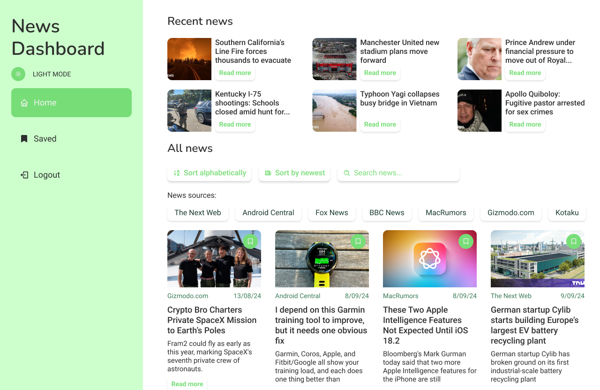
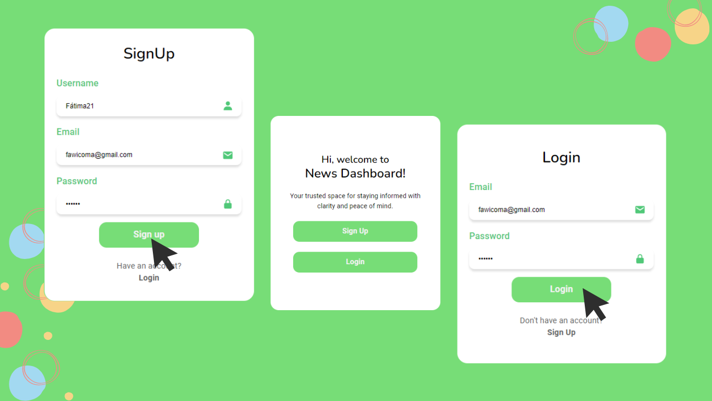

<h1 align="center">News Dashboard</h1>

<div align="center">
   Your trusted space for staying informed with clarity and peace of mind.
</div>

## Table of contents
- [Getting Started](#getting-started)
  - [Built with](#built-with)
  - [Setup Instructions](#setup-instructions)
- [Overview](#overview)
  - [Screenshot](#screenshot)
  - [Links](#links)
- [How to use](#how-to-use)
  - [User account](#user-account)
  - [Home](#home)
  - [Save article](#save-article)
  - [Article](#article)
- [Contact](#contact)

## Getting Started
### Built with


- Typescript
- React
- CSS
- Firebase
- [News API](https://newsapi.org)

### Setup Instructions
1. Clone the repository.
2. Run the following command to install all dependencies:
```
npm install
```
3. Create a ".env" file in the root of the project and add the following variable:
```
VITE_NEWS_API_KEY=your-api-key-here
```
4. Replace "your-api-key-here" with your actual News API key. You can obtain a key by signing up at [News API](https://newsapi.org/).
5. Run the project with the following command:
```
npm run dev
```
To view it open http://localhost:5173

## Overview
### Screenshot

### Links
- Code in Github: [https://github.com/FatimaGR/News-Dashboard](https://github.com/FatimaGR/News-Dashboard)

## How to use
### User account
To use News Dashboard, you need an account. You can log in from the Login page or create a new account on the Sign Up page.



### Home
After you logged in, you will see the "Home" page, where you can browse articles, sort, search, and filter them by news source. 

You will also find the navbar, where you can switch between light and dark mode, go to the "Saved" page, or log out.


### Save article
To save an article, click the green button in the top-right corner of the article. You can view all your saved articles on the "Saved" page.


### Article
To read an article, click the "Read More" button. This will take you to a page with all the details, like date, author, news source, and a link to the original article.


## Contact
- Website - [Fatima Gallardo](https://porfolio-website-gules.vercel.app)
- GitHub - [@FatimaGR](https://github.com/FatimaGR)